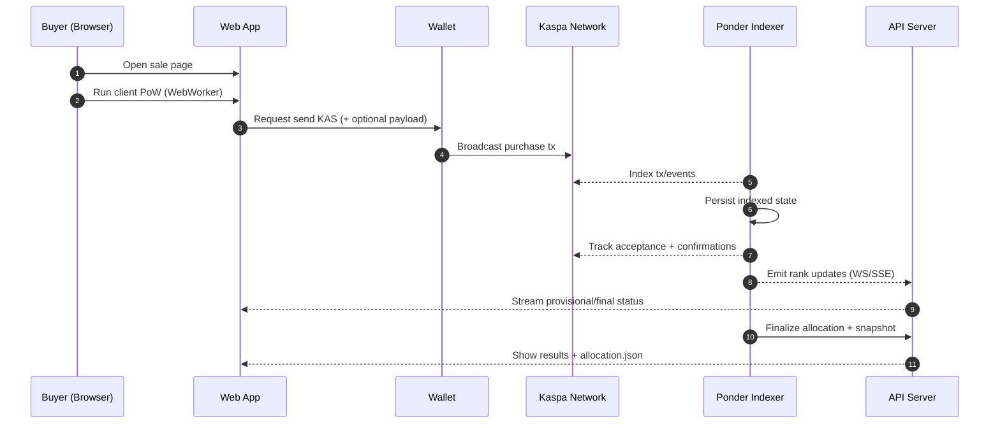
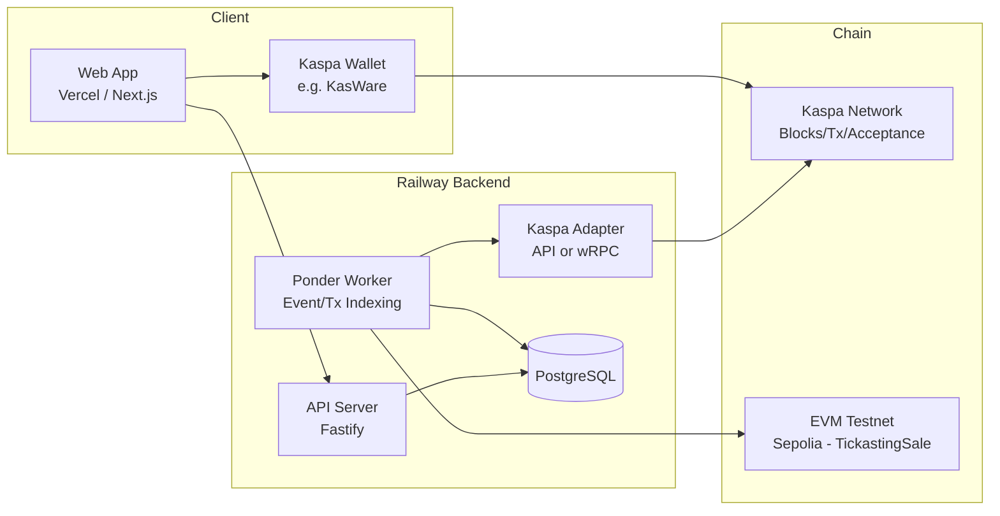

# Tickasting (Kaspa) — 공정 대기열 기반 제로-랙 티켓팅 엔진

> **Principle:** 서버가 “줄”을 만들지 않는다. 체인의 공개 데이터로 누구나 순번을 재현·검증한다.

## Contents
<details>
<summary>목차 펼치기</summary>

- [0. 한 줄 요약](#sec-0)
- [1. 문제 정의(Problem)](#sec-1)
- [2. 해결 전략(Solution Strategy)](#sec-2)
- [3. 목표(Goals) / 비목표(Non-Goals)](#sec-3)
- [4. 사용자(Actors)와 핵심 시나리오](#sec-4)
- [5. 제품 범위(MVP vs 확장)](#sec-5)
- [6. 시스템 아키텍처(High Level)](#sec-6)
- [7. 온체인 설계(구매 트랜잭션)](#sec-7)
- [8. Anti-Bot PoW(클라이언트 경량 PoW)](#sec-8)
- [9. Ordering & Acceptance Engine (핵심)](#sec-9)
- [10. 결과 스냅샷 / 검증(Auditability)](#sec-10)
- [11. 티켓 발급 / 입장 검증](#sec-11)
- [12. API 설계(초안)](#sec-12)
- [13. DB 스키마(권장)](#sec-13)
- [14. 프론트 UX(필수 화면)](#sec-14)
- [15. 운영/보안/컴플라이언스](#sec-15)
- [16. 기술 스택(권장)](#sec-16)
- [17. 레포 구조(권장)](#sec-17)
- [18. 사업화(GTM)](#sec-18)
- [19. 구현 리스크와 대응](#sec-19)
- [20. 참고 문서](#sec-20)

</details>

---

<a id="sec-0"></a>
## 0. 한 줄 요약
Tickasting는 “서버가 줄을 세우지 않는” 티켓팅 시스템이다. 사용자가 Kaspa 트랜잭션을 발행하면, Tickasting는 **온체인 acceptance 기반의 결정적(Deterministic) 규칙**으로 순번을 산출하고 그 순번대로 티켓을 배분한다. 결과는 누구나 재현·검증할 수 있도록 스냅샷/증빙(merkle commit 등)을 제공한다.

---

<a id="sec-1"></a>
## 1. 문제 정의(Problem)
중앙화 티켓팅(일반적인 웹/앱 기반)은 구조적으로 다음 문제가 반복된다.

### 1.1 대기열 병목(Queue Bottleneck)
- 동시 접속 폭주 시 서버/DB가 병목 → 흰 화면, 결제 실패, 재시도 지옥
- “대기열 숫자”는 서버 계산 결과일 뿐, 사용자는 검증 불가

### 1.2 불공정(Unfairness)
- 봇/매크로/인프라 우위(근접 리전, 더 빠른 네트워크)가 이득
- 기존 시스템은 “왜 내가 밀렸는지”에 대한 증빙이 없다

### 1.3 암표(Scalping)
- 1차 구매가 불공정할수록 2차 리셀 시장이 커짐
- L1에서 가격 상한을 강제하기 어려운 체인도 많음(현재 Kaspa도 범용 스마트컨트랙트 강제 모델이 아님)

---

<a id="sec-2"></a>
## 2. 해결 전략(Solution Strategy)

### 2.1 “공정성”의 현실적 정의
Tickasting는 “누가 0.001초 먼저 눌렀냐” 같은 물리시간을 증명한다고 주장하지 않는다.
대신 다음을 보장한다:

1) **서버가 순번을 만들지 않는다.**
2) Kaspa 네트워크에서 관측되는 **accepted 상태 + acceptingBlockHash + confirmations** 같은 공개 데이터로 순번을 만든다.
3) 순번 규칙은 공개되고 결정적이며, 누구나 같은 입력으로 같은 결과를 재현할 수 있다.

### 2.2 UX 원칙: Provisional(임시) vs Final(확정)
- 체인 tip 근처에서는 상태가 변할 수 있으므로,
- UI는 반드시 2단계로 보여준다.

- **Provisional Rank**: accepted 되었고 confirmations < FINALITY_DEPTH
- **Final Rank**: confirmations ≥ FINALITY_DEPTH (확정)

이 구조는 “reorg/변동 가능성”을 숨기지 않고, 오히려 **투명성**으로 제품 신뢰를 만든다.

---

<a id="sec-3"></a>
## 3. 목표(Goals) / 비목표(Non-Goals)

### 3.1 목표(Goals)
- P0: 온체인 기반 공정 대기열 + 실시간 대시보드
- P0: Anti-bot 비용 부과(클라 경량 PoW) + 검증 가능
- P0: 결과 스냅샷(랭킹/당첨) 생성 + 검증 UX
- P0: 멀티 티켓 타입(VIP/R/GEN 등) 지원
- P0: 컨트랙트 기반 claim/mint 플로우(당첨자 온체인 클레임)
- P1: merkle root commit(결과 조작 불가를 한 방에 보여주는 증빙)
- P1: 스캐너(입장 QR 검증) MVP
- P2: 리셀 정책(가격 상한 자체가 아니라 “입장 유효성(attestation)”으로 실효성 확보)

### 3.2 비목표(Non-Goals)
- “전 세계 물리시간 기반 선착순을 완전 증명” 주장 금지
- Kaspa L1에서 리셀 가격 상한을 강제한다고 과장 금지
- 완전한 KYC/실명 인증은 MVP 범위 밖(옵션 모듈)

---

<a id="sec-4"></a>
## 4. 사용자(Actors)와 핵심 시나리오

### 4.1 Actors
- Buyer(구매자): 지갑 연결 → PoW → 결제 tx → 내 순번/당첨 확인
- Organizer(주최자): 이벤트/판매 설정, 수익 주소 관리, 결과 커밋/정산
- Admin(운영): 모니터링/레이트리밋/정책 운영
- Gate Staff(스태프): QR 스캔 → 유효성 확인 → 입장 처리

### 4.2 핵심 플로우(1차 판매)
1) 판매 페이지 오픈
2) 지갑 연결
3) (옵션) “구매 Preflight”(난이도/가격/주소/정책 확인)
4) 브라우저에서 PoW 계산(웹워커)
5) 지갑으로 KAS 전송(tx payload 포함 가능하면 포함)
6) Ponder 인덱서가 treasury 주소 입금/이벤트 감지
7) tx 검증(금액/주소/payload/PoW) → accepted/confirmations 추적
8) Provisional → Final 확정
9) supply 내 rank면 티켓 발급(= winner)

### 4.3 Sequence Diagram (1차 판매)


---

<a id="sec-5"></a>
## 5. 제품 범위(MVP vs 확장)

### 5.1 Hackathon MVP (반드시 구현)
- 판매(Sale) 생성/오픈/종료
- sale 하위 멀티 티켓 타입 정의(타입별 가격/수량)
- Buyer 결제 tx 생성/브로드캐스트(지갑 연동)
- Tx 감지(주소 기반)
- acceptance/confirmations 추적
- 결정적 순번 산출 + Provisional/Final 상태
- winner의 컨트랙트 claim/mint
- 실시간 대시보드(WebSocket/SSE)
- 결과 페이지 + allocation.json(당첨/낙첨 스냅샷)
- 개발/실행 재현 가능한 README(영문)

### 5.2 확장(해커톤 이후)
- merkle root commit tx(결과 스냅샷의 해시를 체인에 커밋)
- Ticket QR / Scanner App(웹)
- 공식 리셀 + attestation(입장 유효성 기반 암표 억제)
- 타입별 특전(perk)/동적 가격 정책/화이트리스트 라운드

---

<a id="sec-6"></a>
## 6. 시스템 아키텍처(High Level)

> **결정 (GP-027, 2026-02-14):** 인덱싱 런타임은 Ponder(`apps/ponder`)로 전환한다.
> 기존 `apps/indexer`는 **deprecated**이며, 전환 완료(GP-035) 후 제거한다.
> 상세 결정 기록: `docs/architecture.md`

### 6.1 런타임 토폴로지 (확정)

| Component | Runtime | Role |
|-----------|---------|------|
| Web App | Vercel | Next.js, presentation + client PoW |
| API Server | Railway | Fastify, domain logic / auth / aggregation |
| Ponder Worker | Railway | Chain event/tx indexing (target) |
| PostgreSQL | Railway | Single source of truth |
| Contract | Sepolia (EVM) | ERC-721 claim/mint (TickastingSale) |
| ~~Indexer~~ | ~~Railway~~ | ~~Legacy custom poller (deprecated)~~ |

### 6.1.1 데이터 소스 책임 분리

- **Ponder** (`apps/ponder`): 체인 이벤트/트랜잭션 인덱싱. Postgres에 인덱싱 결과를 적재. Reorg 처리, 체크포인팅, 리플레이 내장.
- **API** (`apps/api`): 도메인 로직, 권한, 집계. Ponder 테이블 + 자체 도메인 테이블에서 읽기. 순번 계산, allocation 스냅샷 생성, buyer/organizer 엔드포인트 서빙. 체인 직접 폴링 금지.
- **Web** (`apps/web`): 프레젠테이션. API 호출 + WebSocket 실시간 연결. 클라이언트 PoW(WebWorker).

### 6.1.2 Kaspa 연결(플러그형)
- Adapter A: Kas.fyi Developer Platform API(빠른 MVP)
- Adapter B: Direct Node RPC(wRPC) + 자체 노드(정석)

### 6.1.3 Architecture Diagram


### 6.2 “Kaspa Adapter” 설계 원칙
Tickasting는 Kaspa 연결 계층을 인터페이스로 추상화한다. 인덱싱 런타임은 Ponder를 기본으로 사용한다.

#### KaspaAdapter 인터페이스(개념)
- getAddressTransactions(address, cursor?, includePayload?)
- getTransactionsDetails(txids[], includePayload?)
- getTransactionsAcceptance(txids[])
- getBlockDetails(hash)
- (옵션) subscribeUtxosChanged(addresses[])  // direct node 가능 시
- (옵션) submitTransaction(rawTx)             // direct node 또는 node proxy 가능 시

MVP에서는 “주소 거래 목록 + tx acceptance/confirmations”만 있어도 동작한다.
(정교한 VSPC 기반 reorg 처리까지 하려면 direct node 쪽 기능이 필요하지만, MVP에서는 acceptance 변화 감지로 대체 가능)

---

<a id="sec-7"></a>
## 7. 온체인 설계(구매 트랜잭션)

### 7.1 구매 트랜잭션 정의
- Output: treasury_address로 ticket_price_sompi (정확히) 전송
- payload(가능한 경우): Tickasting 메타데이터 + PoW nonce 포함

> 지갑/SDK가 payload 지원하면 반드시 사용한다. payload가 없다면 “고유 결제 주소 per sale” 방식으로 최소 MVP는 가능하지만, PoW/식별력이 약해진다. MVP에서는 payload 지원 지갑(예: KasWare)의 sendKaspa(payload 옵션)를 우선 타깃으로 한다.

### 7.2 Payload 포맷 v1 (hex)
고정 바이너리 → hex 문자열로 넣는다.

- magic(4): "TKS1"
- version(1): 0x01
- saleId(16): UUIDv4 bytes
- buyerAddrHash(20): hash160(address string) 또는 sha256(address) 앞 20바이트
- clientTimeMs(8): uint64 (정렬 기준 아님. 디버깅/재전송 방지용)
- powAlgo(1): 0x01 (sha256)
- powDifficulty(1): 예) 18
- powNonce(8): uint64
- reserved(variable): 향후 확장

### 7.3 Tx 검증 규칙(엔진이 인정하는 조건)
- sale 기간 내 tx(DetectedAt 기준 + blockTime 참고)
- tx outputs 중 treasury_address로 ticket_price_sompi 전송 존재
- payload가 있다면:
    - magic/saleId/version 일치
    - PoW 검증 통과
- accepted=true 인 tx만 큐 후보로 편입(accepted 추적은 Adapter로 구현)

### 7.4 Contract 책임 범위(신규)
- 컨트랙트는 “누가 어떤 티켓 타입을 claim 가능한지”를 최종 기록한다.
- 오프체인 엔진은 rank/winner 계산 후 claim 대상자 목록(또는 증빙)을 제공한다.
- 컨트랙트는 최소 아래를 강제한다.
  - 타입별 최대 발행량 초과 금지
  - 동일 winner의 중복 claim 금지
  - claim 성공 시 타입/소유자/토큰ID 이벤트 기록
- 즉, 순위 계산은 오프체인 결정적 엔진, 소유권/타입 귀속은 온체인 컨트랙트로 분리한다.

---

<a id="sec-8"></a>
## 8. Anti-Bot PoW(클라이언트 경량 PoW)

### 8.1 목표
- 봇을 “차단”이 아니라 “대량 발행 비용을 증가”시킨다.
- 검증은 서버가 누구나 재현 가능해야 한다.

### 8.2 퍼즐 정의(v1)
해시: SHA-256 (브라우저 구현 쉬움)

입력:
`msg = "TickastingPoW|v1|" + saleId + "|" + buyerAddrHashHex + "|" + powNonceUint64`

조건:
`sha256(msg)` 해시의 leading zero bits ≥ difficulty

difficulty는 sale 설정으로 고정(또는 라운드 단위로 변경 가능)
- desktop 기준 0.2~1.0초 목표
- mobile 기준 0.3~1.5초 목표

### 8.3 UX 정책
- PoW는 WebWorker로 수행(메인 UI 프리즈 금지)
- 진행률은 “추정치”로 표시(정확한 %는 어려움)
- 사용자가 취소 가능해야 함
- 난이도 부족이면 전송 전에 명확히 안내

---

<a id="sec-9"></a>
## 9. Ordering & Acceptance Engine (핵심)

### 9.1 상태 머신
- DETECTED: treasury address에 들어온 tx를 감지
- VALIDATED: 금액/주소/payload/PoW 검증 통과
- ACCEPTED: isAccepted=true
- FINAL: confirmations ≥ FINALITY_DEPTH

### 9.2 순번 산출(결정적 규칙)
Tickasting는 “결정적 순서 규칙”을 공개한다.

#### Candidate Set(후보 집합)
- VALIDATED 이면서 ACCEPTED인 tx들

#### Primary Key(기본 정렬 키)
- acceptingBlockHash 기준 정렬 (acceptingBlockHash의 block blueScore 오름차순)
- tie-breaker: txid lexicographic ascending

> 같은 acceptingBlockHash 내에서 “acceptedTxIds 순서”를 가져올 수 있으면 더 좋지만,
> 외부 API 기반 MVP에서는 tie-breaker로 txid를 사용한다. 이는 완전 결정적이며 재현 가능하다.

#### Provisional Rank
- Candidate set에 대해 정렬 후 1..N 부여

#### Final Rank
- confirmations ≥ FINALITY_DEPTH 된 tx만 Final 후보로 두고 동일 정렬 규칙 적용 후 1..M 부여

### 9.3 당첨 규칙
- finalRank ≤ supply_total => winner
- 그 외 => loser

---

<a id="sec-10"></a>
## 10. 결과 스냅샷 / 검증(Auditability)

### 10.1 allocation.json (필수)
판매 종료 후 생성되는 결과 파일.

#### 스키마(예시)
```json
{
  "saleId": "uuid",
  "network": "mainnet|testnet",
  "treasuryAddress": "kaspa:...",
  "ticketPriceSompi": "12345",
  "supplyTotal": 100,
  "finalityDepth": 30,
  "pow": { "algo": "sha256", "difficulty": 18 },
  "orderingRule": {
    "primary": "acceptingBlockHash.blueScore asc",
    "tiebreaker": "txid lexicographic asc"
  },
  "generatedAt": "ISO8601",
  "winners": [
    {
      "finalRank": 1,
      "txid": "hex",
      "acceptingBlockHash": "hex",
      "confirmations": 42,
      "payload": "0x....",
      "buyerAddrHash": "hex"
    }
  ],
  "losersCount": 999
}
```

### 10.2 Merkle Commit (P1, 권장)
- `winners` 리스트(또는 `allocation.json` 전체)에 대해 merkle root 생성
- Organizer가 merkle root를 payload에 넣은 “Commit Tx” 1건 발행
- 결과 페이지에 `commitTxid` 표기 + 검증 방법 안내
- 해커톤 데모에서 “조작 불가”를 가장 직관적으로 보여주는 장치

---

<a id="sec-11"></a>
## 11. 티켓 발급 / 입장 검증

### 11.1 MVP 티켓(해커톤)
- winner가 컨트랙트에서 타입별 티켓 claim/mint
- DB에는 claim 결과(토큰ID/tx hash) 캐시 + QR 생성
- QR에 `ticketId + saleId + txid + serverSignature` 포함(위변조 방지)

### 11.2 티켓 타입 모델
- 하나의 sale에 여러 타입을 둔다.
  - 예: `VIP`, `R`, `GEN`
- 타입별 필드:
  - `priceSompi`
  - `supply`
  - `metadataUri`
  - `perk` (옵션, 텍스트/JSON)
- claim 시 사용자는 당첨된 타입의 티켓만 mint 가능해야 한다.

### 11.3 암표 실효성 모델(중요)
- L1에서 가격 상한을 강제하기 어렵다면, **입장(현실)에서 통제**
- 공식 리셀에서만 `attestation`(유효성 갱신)을 발급
- 스캐너는 `attestation` 없으면 invalid 처리 가능
- 즉 “비싸게 팔아도 입장 못 하면 수익이 무너짐”

---

<a id="sec-12"></a>
## 12. API 설계(초안)

### 12.1 Organizer
```http
POST /v1/events
POST /v1/events/:eventId/sales
POST /v1/sales/:saleId/ticket-types
PATCH /v1/sales/:saleId/ticket-types/:ticketTypeId
POST /v1/sales/:saleId/publish
POST /v1/sales/:saleId/finalize
```

### 12.2 Buyer
```http
GET  /v1/sales/:saleId
GET  /v1/sales/:saleId/ticket-types
POST /v1/sales/:saleId/preflight
GET  /v1/sales/:saleId/my-status?txid=...
POST /v1/sales/:saleId/claim
```

### 12.3 Realtime
- `WS /ws/sales/:saleId`
- Event types:
  - `sale_state`
  - `attempt_detected`
  - `attempt_validated`
  - `attempt_accepted`
  - `rank_update`
  - `supply_update`
  - `finalized`

### 12.4 Scanner
```http
POST /v1/scans/verify
POST /v1/scans/redeem
```

---

<a id="sec-13"></a>
## 13. DB 스키마(권장)

### 13.1 `events`
- `id` (uuid)
- `organizer_id`
- `title`, `venue`
- `start_at`, `end_at`
- `status` (`draft|published|archived`)
- `created_at`, `updated_at`

### 13.2 `sales`
- `id` (uuid)
- `event_id`
- `network` (`mainnet|testnet`)
- `treasury_address`
- `ticket_price_sompi` (bigint)
- `supply_total` (int)
- `max_per_address` (int, optional)
- `pow_difficulty` (int)
- `finality_depth` (int)
- `start_at`, `end_at`
- `status` (`scheduled|live|finalizing|finalized`)
- `merkle_root` (nullable)
- `commit_txid` (nullable)
- `claim_contract_address` (nullable)
- `created_at`, `updated_at`

### 13.3 `ticket_types` (신규)
- `id` (uuid)
- `sale_id`
- `code` (예: VIP/R/GEN, sale 내 unique)
- `name`
- `price_sompi` (bigint)
- `supply` (int)
- `metadata_uri`
- `perk` (json, optional)
- `sort_order`
- `created_at`, `updated_at`

### 13.4 `purchase_attempts`
- `id` (uuid)
- `sale_id`
- `requested_ticket_type_id` (nullable)
- `txid` (unique)
- `detected_at`
- `validation_status` (`pending|valid|invalid_*`)
- `invalid_reason`
- `payload_hex`
- `buyer_addr_hash`
- `accepted` (bool)
- `accepting_block_hash`
- `accepting_blue_score`
- `confirmations` (int)
- `provisional_rank`
- `final_rank`
- `last_checked_at`

### 13.5 `tickets`
- `id` (uuid)
- `sale_id`
- `ticket_type_id`
- `owner_address`
- `owner_addr_hash`
- `origin_txid`
- `claim_txid` (nullable)
- `token_id` (nullable)
- `status` (`issued|redeemed|cancelled`)
- `qr_signature`
- `issued_at`, `redeemed_at`

### 13.6 `scans`
- `id`
- `ticket_id`
- `scanned_at`
- `gate_id`
- `result` (`ok|deny_reason`)
- `operator_id`

---

<a id="sec-14"></a>
## 14. 프론트 UX(필수 화면)

### 14.1 Sale Landing
- 지갑 연결
- 가격/수량/난이도
- “공정성 설명”(서버가 아닌 체인이 순번 결정)

### 14.2 Live Dashboard
- remaining supply / total attempts / accepted / finalized
- 실시간 스트림(상태 변화)
- “내 tx 상태”(provisional/final/confirmations)

### 14.3 Result Page
- winners 테이블 + 검색(txid)
- `allocation.json` 다운로드
- (P1) merkle root + commit txid + 검증 방법

### 14.4 Ticket Wallet(옵션)
- QR 표시
- 스캔 로그/상태

---

<a id="sec-15"></a>
## 15. 운영/보안/컴플라이언스

### 15.1 Key 관리
- Organizer treasury 키는 서버에 장기 보관 금지(프로덕션)
- MVP에서는 테스트키/소액만 사용(환경변수로 주입)

### 15.2 레이트리밋
- API(특히 preflight)는 IP/세션 레이트리밋
- WS는 연결 제한(동시 연결 수)

### 15.3 악용/부정행위
- payload 위조 시 PoW 검증 실패로 무효화
- 동일 txid 중복은 DB unique로 방지
- saleId 불일치 payload는 무시

---

<a id="sec-16"></a>
## 16. 기술 스택(권장)
- Monorepo: pnpm + turbo(또는 nx)
- Web: Next.js + TypeScript + Tailwind + Zustand
- API: Node.js TS + Fastify(or Nest) + Zod validation + Socket.IO(ws)
- Indexing: Ponder
- DB: Postgres(Prisma) + Redis(ioredis)
- Test: Vitest + Playwright(옵션)
- Infra: Docker compose(MVP)

---

<a id="sec-17"></a>
## 17. 레포 구조(권장)
```text
apps/web
apps/api
apps/ponder
apps/indexer (legacy/deprecated after Ponder migration)
packages/shared (payload/PoW/ordering utils)
infra/docker (postgres/redis)
docs (아키텍처/검증 방법)
PROJECT.md (본 문서)
TICKET.md (작업 티켓)
LICENSE (MIT 권장)
README.md (영문, 재현 가능한 실행법)
```

---

<a id="sec-18"></a>
## 18. 사업화(GTM)

### 18.1 고객
- K-pop 팬덤/콘서트
- 스포츠 이벤트
- 컨퍼런스/페스티벌

### 18.2 수익모델
- SaaS: 이벤트당 + 티켓당 수수료
- Enterprise: 온프레미스 구축 + 유지보수
- Stress Test as a Service: 체인 성능 실측/리포트 제공(마케팅 + 기술 검증)

### 18.3 핵심 메시지
- “대기열 숫자를 서버가 만들지 않는다. 공개 데이터로 누구나 검증한다.”

---

<a id="sec-19"></a>
## 19. 구현 리스크와 대응
- 네트워크 전파 지연/리전 편차: 숨기지 않고 `accepted/confirmations` 투명 공개
- reorg/변동: Provisional/Final 2단 UX + `finalityDepth`로 흡수
- payload 미지원 지갑: payload 지원 지갑 우선 + fallback 모드(단, PoW 약화)

---

<a id="sec-20"></a>
## 20. 참고 문서
> 아래 링크들은 참고용이며, 실제 구현 전 최신 문서를 재확인할 것.

- KasWare Wallet Kaspa Integration (`window.kasware`, `sendKaspa(payload)`): https://docs.kasware.xyz/wallet/dev-base/kaspa
- Kas.fyi Developer Platform API (tx details / tx acceptance / address tx): https://docs.kas.fyi/
- Kaspa WASM SDK/Docs(Aspectron): https://kaspa.aspectron.org/documentation.html (또는 https://kaspa.aspectron.org/docs/)
- Kaspa 공식 사이트: https://kaspa.org/
