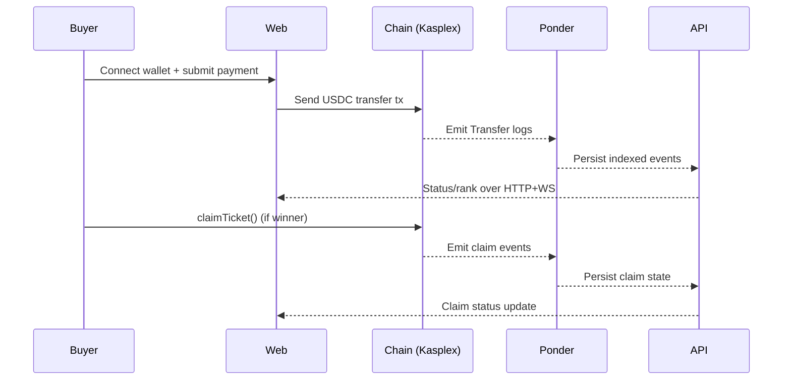

# Tickasting - Deterministic Fair Queue Ticketing Engine

> Principle: the server does not create queue order. Anyone can reproduce ordering from public chain data.

<details>
<summary>Table of Contents</summary>

- [0. One-Line Summary](#sec-0)
- [1. Problem](#sec-1)
- [2. Solution Strategy](#sec-2)
- [3. Goals and Non-Goals](#sec-3)
- [4. Actors and Core Scenarios](#sec-4)
- [5. Product Scope](#sec-5)
- [6. System Architecture](#sec-6)
- [7. On-Chain Purchase Model](#sec-7)
- [8. Ordering Engine](#sec-8)
- [9. Allocation and Auditability](#sec-9)
- [10. Ticket Issuance and Gate Verification](#sec-10)
- [11. API Outline](#sec-11)
- [12. Database Model](#sec-12)
- [13. Frontend UX](#sec-13)
- [14. Security and Operations](#sec-14)
- [15. Recommended Tech Stack](#sec-15)
- [16. Repository Layout](#sec-16)
- [17. GTM Notes](#sec-17)
- [18. Risks and Mitigations](#sec-18)
- [19. References](#sec-19)
- [20. Changelog Notes](#sec-20)

</details>

<a id="sec-0"></a>
## 0. One-Line Summary

Tickasting is a fair ticketing system that computes buyer ranking from deterministic on-chain signals and publishes reproducible allocation outputs.

<a id="sec-1"></a>
## 1. Problem

Centralized ticketing repeatedly fails in three areas:

1. Queue bottlenecks under burst traffic.
2. Unverifiable fairness claims.
3. Incentives for scalping and automation abuse.

Users usually cannot verify why they won or lost. The queue number shown by a server is not independently auditable.

<a id="sec-2"></a>
## 2. Solution Strategy

Tickasting defines fairness as reproducibility, not perfect real-time latency equality.

Core guarantees:

1. Queue order is derived from public chain data.
2. Ordering rules are deterministic and documented.
3. Any observer can recompute winners from the same inputs.

The UX exposes both states clearly:

- `Provisional`: detected and valid but not final by confirmation depth.
- `Final`: confirmed past finality threshold.

<a id="sec-3"></a>
## 3. Goals and Non-Goals

### 3.1 Goals

- Deterministic, on-chain-driven ordering.
- Real-time status updates during sale lifecycle.
- Reproducible winner allocation and Merkle proof generation.
- Multi ticket-type support.
- Contract-based claim/mint workflow.

### 3.2 Non-Goals

- Claiming absolute global physical-time fairness.
- Overstating protocol-level resale price enforcement.
- Full KYC identity stack in MVP.

<a id="sec-4"></a>
## 4. Actors and Core Scenarios

Actors:

- Buyer: connects wallet, pays, tracks rank/status, claims if winner.
- Organizer: creates events/sales, configures ticket types, finalizes outputs.
- Admin: monitors runtime health, abuse controls, and release ops.
- Gate staff: verifies QR ticket validity and redemption state.

Primary sale flow:

1. Sale page opens.
2. Buyer connects wallet.
3. Buyer sends payment transaction.
4. Index layer ingests on-chain payment events.
5. Engine validates attempts and computes deterministic ordering.
6. Buyers observe provisional and final states.
7. Winners claim on contract.



<a id="sec-5"></a>
## 5. Product Scope

### 5.1 MVP

- Event and sale lifecycle (`scheduled -> live -> finalizing -> finalized`).
- Multi ticket-type support.
- On-chain purchase detection from payment token transfers.
- Deterministic rank computation and winner allocation.
- Claim flow and ownership indexing.
- Real-time dashboard and buyer status API.

### 5.2 Post-MVP

- Extended resale attestation model.
- Expanded gate tooling and operator consoles.
- Rich anti-abuse policy controls.

<a id="sec-6"></a>
## 6. System Architecture

Current production target is EVM-first indexing.

Runtime topology:

- `apps/web`: Next.js frontend.
- `apps/api`: Fastify domain API.
- `apps/ponder`: on-chain indexer for payment/claim events.
- PostgreSQL: shared data store.

Legacy component:

- `apps/indexer` exists for old Kaspa-native flow and is deprecated.

Responsibility split:

- Ponder: event ingestion, checkpointing, replay, and reorg-safe indexed tables.
- API: business rules, ranking, allocation generation, proof endpoints.
- Web: wallet UX, transaction submission, and real-time status rendering.

<a id="sec-7"></a>
## 7. On-Chain Purchase Model

Current default mode is EVM purchase mode (`PURCHASE_MODE=evm`).

Payment source:

- Token: USDC on Kasplex testnet.
- Signal: ERC-20 `Transfer` event to sale treasury address.

Validation:

1. Transfer destination matches sale treasury address.
2. Transfer amount matches one allowed ticket price.
3. Transfer timestamp is inside sale window (when configured).

This produces deterministic purchase attempts without server-side queue generation.

<a id="sec-8"></a>
## 8. Ordering Engine

Sorting keys for EVM mode:

1. `blockNumber` ascending.
2. `logIndex` ascending.
3. `txHash` ascending.

Finalization:

- Confirmations are derived from current chain tip minus transfer block number.
- Final candidates satisfy `confirmations >= finalityDepth`.

Winner rule:

- Top `supplyTotal` final attempts are winners.

<a id="sec-9"></a>
## 9. Allocation and Auditability

For each sale, API can produce:

- `allocation` snapshot
- `winners` with deterministic rank
- `merkleRoot`
- optional `commitTxid`

This enables third-party verification and reproducible proofs.

<a id="sec-10"></a>
## 10. Ticket Issuance and Gate Verification

Winner flow:

1. Winner claims via contract call.
2. Claim event indexed by Ponder.
3. API/web surfaces claim and ownership state.

Gate flow:

- Ticket QR includes signed payload.
- Scanner verifies signature and redemption state.
- One-time redemption is enforced by backend state.

<a id="sec-11"></a>
## 11. API Outline

Core routes:

- Events: create/list/get.
- Sales: create/publish/finalize/get/stats/allocation/proofs.
- Claims: status/sync/consistency.
- Scanner: issue/verify/redeem.
- WebSocket: live sale status stream.

Design principle:

- Expose reproducible states, not opaque queue internals.

<a id="sec-12"></a>
## 12. Database Model

Primary entities:

- `events`
- `sales`
- `ticket_types`
- `purchase_attempts` (legacy path compatibility)
- `tickets`
- `scans`

On-chain indexed entities (Ponder):

- `sales_onchain`
- `ticket_types_onchain`
- `claims_onchain`
- `token_ownership`
- `payment_transfers_onchain`

<a id="sec-13"></a>
## 13. Frontend UX

Required screens:

- Sale purchase page.
- Live dashboard.
- Allocation/results page.
- Scanner page (operator).

UX requirements:

- Show wallet/network/payment status clearly.
- Distinguish provisional vs final states.
- Display ranking and winner proof artifacts.

<a id="sec-14"></a>
## 14. Security and Operations

Operational controls:

- Strict environment variable management.
- Rate limiting on API and websocket endpoints.
- Defensive validation for all externally submitted values.

Abuse controls:

- Reject mismatched amount/treasury transfers.
- Prevent duplicate ticket issuance and redemption.
- Keep deterministic ordering logic immutable per release.

<a id="sec-15"></a>
## 15. Recommended Tech Stack

- Monorepo: pnpm workspaces.
- API: Node.js + Fastify + Prisma.
- Indexing: Ponder.
- Web: Next.js + TypeScript.
- DB: PostgreSQL.

<a id="sec-16"></a>
## 16. Repository Layout

```text
apps/
  api/
  ponder/
  web/
  indexer/      (legacy)
contracts/
packages/
  shared/
docs/
README.md
PROJECT.md
```

<a id="sec-17"></a>
## 17. GTM Notes

Target segments:

- Concert and fan community ticketing.
- Sports and conference ticketing.
- Any high-demand drop requiring auditable queue fairness.

Messaging:

- Queue order is chain-derived and reproducible.
- Winner allocation is auditable with deterministic rules.

<a id="sec-18"></a>
## 18. Risks and Mitigations

1. Chain reorgs near tip.
   - Mitigation: provisional/final split with configurable finality depth.
2. RPC/indexing lag.
   - Mitigation: health endpoints, alerting, and replay-capable indexer.
3. Wallet UX mismatch.
   - Mitigation: explicit chain checks and user guidance.

<a id="sec-19"></a>
## 19. References

- Kasplex RPC: `https://rpc.kasplextest.xyz`
- Ponder docs: `https://ponder.sh`
- OpenZeppelin contracts: `https://docs.openzeppelin.com/contracts`

<a id="sec-20"></a>
## 20. Changelog Notes

- This document is now maintained in English for public-facing repository use.
- Legacy Kaspa-native notes were replaced with EVM-first operational guidance.
- 2026-02-15:
  - Web public runtime values are treated as non-secret and pinned in frontend code defaults:
    - `NEXT_PUBLIC_API_URL=https://api-tickasting.studioliq.com`
    - `NEXT_PUBLIC_WS_URL=wss://api-tickasting.studioliq.com`
    - `NEXT_PUBLIC_EVM_EXPLORER_URL=https://explorer.testnet.kasplextest.xyz`
    - `NEXT_PUBLIC_TICKASTING_CONTRACT_ADDRESS=0x63564786b99FFD006b30fdCCFf1d797723ebD598`
    - `NEXT_PUBLIC_PAYMENT_TOKEN_ADDRESS=0x593Cd4124ffE9D11B3114259fbC170a5759E0f54`
    - `NEXT_PUBLIC_PAYMENT_TOKEN_SYMBOL=USDC`
    - `NEXT_PUBLIC_PAYMENT_TOKEN_DECIMALS=6`
    - `NEXT_PUBLIC_KASPLEX_CHAIN_ID=167012`
  - Buyer flow updated to support auto-claim sequence on winner detection:
    - Payment tx detected -> winner finalized -> Merkle proof fetched -> `claimTicket()` sent.
    - Claim sync is attempted to API so `My Tickets` can reflect ownership faster.
  - "Rollback" semantics clarified:
    - If payment tx is rejected/reverted, rollback is implicit (no on-chain transfer).
    - If payment tx succeeds but user loses, this is not rollback-capable on-chain and requires a separate refund policy/flow.
